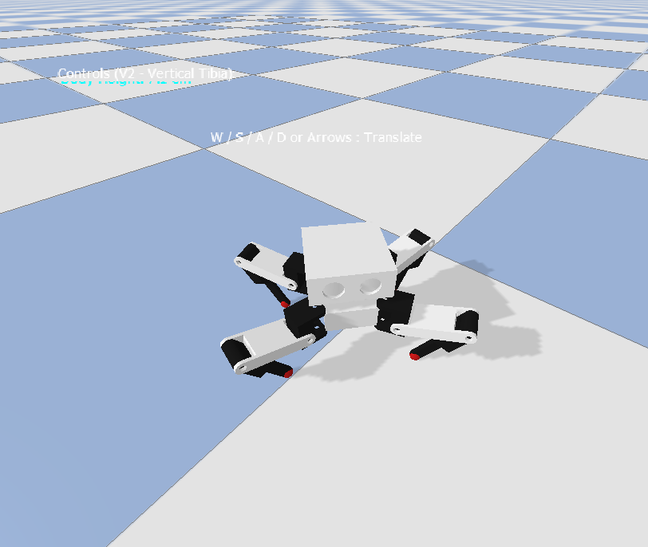

# Quadruped Spider Robot 🕷️

<p align="center">
  
</p>

A **4-legged quadruped spider robot** simulation and locomotion control workspace built with **PyBullet**. The 3D model is designed in **FreeCAD** and exported as STL meshes for physics simulation.

This project implements a high-performance **Analytical Inverse Kinematics (IK)** solver, a **Diagonal Trot Gait Generator** with dynamic trajectory shaping, and multiple **autonomous navigation & path planning algorithms (V4 - V8)**.

---

## 📋 Table of Contents

- [Features](#-features)
- [Project Structure](#-project-structure)
- [Coordinate System](#-coordinate-system)
- [Kinematics & Control](#-kinematics--control)
- [Autonomous Navigation Versions (V4 - V8)](#-autonomous-navigation-versions-v4---v8)
- [Benchmark Results](#-benchmark-results)
- [Installation](#-installation)
- [Usage](#-usage)
- [Locomotion Versions (V1 - V3)](#-locomotion-versions-v1---v3)
- [Testing](#-testing)
- [Physics Parameters](#-physics-parameters)

---

## ✨ Features

- **Realistic 3D model** — Body, coxa, femur, and tibia meshes exported from FreeCAD
- **PyBullet physics** — Accurate rigid-body dynamics with joint damping, friction, and contact forces
- **Analytical Inverse Kinematics (IK)** — Custom 3-DOF per-leg closed-form solver with perfect reconstruction accuracy ($0.00$ m error)
- **Smooth Trajectory Planning** — Parabolic vertical swing curves and horizontal cosine acceleration profiles to prevent joint impact shocks
- **Stance Overlap (Double Support)** — Configurable duty factor (e.g. 55%) ensuring a stable 4-foot stance phase during step transitions
- **Dynamic Gait Scaling** — Automatically scales down step size and increases stance overlap as body height increases to stabilize the Center of Mass (CoM)
- **Interactive Keyboard Control** — Real-time keyboard control (WASD/Arrows for translation, Q/E for turning, Z/X for height) with a 3rd-person follow camera
- **Autonomous Path Planning & Avoidance** — Implementation of A*, Dijkstra, APF, and Model Predictive Control (MPC) with multi-agent benchmarking and trajectory plotting

---

## 📁 Project Structure

```
Quadruped-Spider/
│
├── assets/
│   ├── spider.urdf           # Robot URDF model (12 DOF, 4 legs × 3 joints)
│   ├── test_axis.urdf        # Coordinate axis visualization URDF
│   └── meshes/
│       ├── main_body.stl     # Robot chassis mesh
│       ├── coxa.stl          # Coxa (hip) segment mesh
│       ├── femur.stl         # Femur (upper leg) segment mesh
│       └── tibia.stl         # Tibia (lower leg) segment mesh
│
├── docs/
│   └── spider_preview.png    # Robot preview screenshot
│
├── images/
│   └── image.png             # Raw screenshot folder
│
├── src/
│   ├── __init__.py           # Package initializer
│   ├── spider_ik.py          # Analytical Inverse Kinematics solver
│   ├── gait_controller.py    # Gait V1: Trot gait generator (standard splay)
│   ├── gait_controller_v2.py # Gait V2: Trot gait with vertical tibia & dynamic splay
│   ├── gait_controller_v3.py # Gait V3: Crawl gait with dynamic CoM shifting
│   └── path_planning.py      # GridMap, A*, Dijkstra, and Pure Pursuit implementations
│
├── testing/
│   ├── test_1_standing.py    # Test 1: Standing stability test
│   └── test_2_attitude.py    # Test 2: Attitude control & motion test
│
├── tools/
│   ├── basic_axis_check.py   # Coordinate axis alignment verification
│   ├── interactive_calibration.py # Interactive joint calibration tool
│   └── calibration_results.json   # Calibration saved configurations
│
├── walk_demo.py              # Demo script to walk exactly 1.0 meter forward
├── keyboard_control.py       # Interactive keyboard control (Gait V1)
├── keyboard_control_v2.py    # Interactive keyboard control (Gait V2, Vertical Tibia)
├── keyboard_control_v3.py    # Interactive keyboard control (Gait V3, Crawl Gait)
├── autonomous_v4_apf.py      # V4: Reactive Artificial Potential Field Navigation
├── autonomous_v5_astar.py    # V5: A* Search Global Path Planning & Tracking
├── autonomous_v6_dijkstra.py # V6: Dijkstra Search Global Path Planning & Tracking
├── autonomous_v7_mpc.py      # V7: Model Predictive Control (MPC) Path Planning
├── autonomous_v8_all.py      # V8: Multi-Robot Joint Race & Benchmark Plotting
├── trajectory_comparison.png # Automatically generated V8 benchmark graph
├── display_robot.py          # Visualize robot in PyBullet GUI
├── requirements.txt          # Python dependencies
└── README.md
```

---

## 🧭 Coordinate System

This project uses **FreeCAD's default coordinate convention**:

| Direction | World Axis | Description |
|-----------|-----------|-------------|
| **Front** (Depan) | **−Y** | Robot faces negative Y |
| **Rear** (Belakang) | **+Y** | Back of robot |
| **Left** (Kiri) | **+X** | Robot's left side |
| **Right** (Kanan) | **−X** | Robot's right side |
| **Up** | **+Z** | Vertical up |

---

## ⚙️ Kinematics & Control

### Leg Degrees of Freedom (12 DOF Total)

Each of the 4 legs has **3 revolute joints**:
```
main_body
  └─ coxa_joint  (Z-axis rotation, yaw/sweep)
       └─ femur_joint  (Y-axis rotation, pitch up/down)
            └─ tibia_joint  (Y-axis rotation, pitch up/down)
                 └─ foot (fixed sphere, contact point)
```

---

## 🤖 Autonomous Navigation Versions (V4 - V8)

### 🐾 V4: Reactive APF (`autonomous_v4_apf.py`)
* Locomotion uses a reactive **Artificial Potential Field (APF)** to steer the robot dynamically.
* Features a custom **curl force** (hysteresis cooldown memory) to prevent getting stuck in local minima.
* Employs an automated reverse escape maneuver when a stall is detected.
* Scanning range: 45 cm Front LiDAR arc.

### 🐾 V5: A* Global Planning (`autonomous_v5_astar.py`)
* Computes the globally shortest path on an occupancy grid using the **A* Search** algorithm.
* Employs **Pure Pursuit** path tracking to follow A* waypoints smoothly.
* Integrates a reactive LiDAR-based obstacle avoidance override for dynamic safety.

### 🐾 V6: Dijkstra Global Planning (`autonomous_v6_dijkstra.py`)
* Computes the global path using **Dijkstra's Algorithm**.
* Uses **Pure Pursuit** for waypoint tracking and a 45 cm LiDAR warning safety zone.
* Offers comparable accuracy to A* but explores all coordinate cells uniformly.

### 🐾 V7: Model Predictive Control (`autonomous_v7_mpc.py`)
* Solves a local non-linear optimization problem over a prediction horizon ($N=4$, $dt=0.6\text{s}$).
* Uses **Hybrid MPC** to follow A*'s global path while dynamically optimizing velocities.
* Enforces high obstacle repulsive costs to guarantee zero collision contact.

### 🐾 V8: Joint Benchmark Race (`autonomous_v8_all.py`)
* Spawns **all 4 robot models concurrently** in a single Pybullet simulation:
  * 🔴 **V4 (APF):** Red
  * 🟢 **V5 (A*):** Green
  * 🔵 **V6 (Dijkstra):** Blue
  * ⚫ **V7 (MPC):** Black
* Collision filters are applied to let robots pass through each other (*no inter-robot collision*) while keeping full collision physics with obstacles and the ground.
* Logs individual execution times and automatically outputs a coordinate trajectory comparison plot.

---

## 📈 Benchmark Results

Using an obstacle course with a **30 cm safety bubble** (GridMap `safe_margin=0.15`) and **50 cm minimum edge-to-edge gaps** between obstacles, all 4 robots successfully navigate from the start `[-5.0, -5.0]` to the target beacon `[5.0, 5.0]`:

| Algorithm | Stance Color | Path Type | Stance Width | Finish Time (s) |
|---|---|---|---|---|
| **V4 (APF)** | Red 🔴 | Local Reactive | $\approx 22.0 - 28.6$ cm | **48.43s** 🥇 |
| **V6 (Dijkstra)** | Blue 🔵 | Global + Tracker | $\approx 22.0 - 28.6$ cm | **52.26s** 🥈 |
| **V5 (A*)** | Green 🟢 | Global + Tracker | $\approx 22.0 - 28.6$ cm | **55.03s** 🥉 |
| **V7 (Hybrid MPC)** | Black ⚫ | Optimal Tracker | $\approx 22.0 - 28.6$ cm | **107.44s** |

> **Note:** V7 (MPC) is computationally heavier due to the scipy non-linear optimizer running inside a single-thread sequential Python loop alongside 3 other robots. On physical hardware, this is typically multi-threaded for real-time control.

---

## 🔧 Installation

### Prerequisites

- Python 3.9+

### Steps

```bash
git clone https://github.com/fitranurmayadi/Quadrupped-Spider.git
cd Quadrupped-Spider
pip install -r requirements.txt
```

---

## 🚀 Usage

### 🎮 Interactive Keyboard Control
Run the **Vertical Tibia V2** interactive controller:
```bash
python keyboard_control_v2.py
```
*Make sure to click/focus the PyBullet GUI window to capture keyboard input.*

**Key Mappings:**
- **`W` / `S` / `A` / `D`** (or **Arrow Keys**): Translate Forward, Backward, Left, Right
- **`Q` / `E`**: Rotate Turn Left / Turn Right
- **`Z`** / **`X`**: Raise / Lower Body Height (4.0 cm to 10.0 cm)
- **`R`**: Reset Robot Position & Height
- **`ESC`**: Exit Simulation

### 🏁 Run Autonomous Benchmarks (V8 All)
To run the joint race simulation in GUI mode:
```bash
python autonomous_v8_all.py
```
To run in headless mode (perfect for fast testing / CI) and regenerate the comparison plot `trajectory_comparison.png`:
```bash
python autonomous_v8_all.py --headless
```

---

## 🔄 Locomotion Versions (V1 - V3)

### 🐾 Gait V1 (`gait_controller.py` & `keyboard_control.py`)
- **Gait**: standard diagonal trot.
- **Splay**: Fixed footprint width.
- **Camera**: Top-down view.

### 🐾 Gait V2 (`gait_controller_v2.py` & `keyboard_control_v2.py`)
- **Vertical Tibia**: Femur and Tibia angles are automatically constrained to keep the tibia link at exactly **$90^\circ$ vertical** to the ground when standing.
- **Dynamic Footprint Splay**: The horizontal foot placement distance ($r$) is calculated dynamically from the height:
  $$r = \sqrt{L_2^2 - (z_{\text{proj}} + L_3)^2}$$
- **Stance Overlap (Double Support)**: `duty_factor` of 0.55 ensures all four feet remain on the ground for 10% of the cycle time during step transitions.
- **Cosine Swing Profile**: Reduces foot horizontal speed to zero before touchdown to prevent hard impacts.
- **Dynamic Gait Scaling**: Shuts down step length and height (down to 50%) at high heights to stabilize the Center of Mass (CoM).
- **Camera**: Low-angle third-person tracking view.

### 🐾 Gait V3 (`gait_controller_v3.py` & `keyboard_control_v3.py`)
- **Static Stability**: **3 legs always touch the ground** at any time. Only 1 leg swings in sequence (FL -> RR -> FR -> RL) using a 75% stance duty factor.
- **CoM Shifting**: Before any leg swings, the body center is dynamically shifted towards the centroid of the remaining 3 support legs to maintain static balance.
- **V2 Features Included**: Integrates the vertical tibia constraint, dynamic splay, and smooth cosine swing profiles.

---

## 🧪 Testing

### Walk 1 Meter forward
Runs the robot forward exactly 1.0 meter and terminates.
```bash
python walk_demo.py --headless
```

### Standing Stability Check
```bash
python testing/test_1_standing.py --headless
```

---

## 🏗️ Physics Parameters

| Parameter | Value | Notes |
|-----------|-------|-------|
| Simulation timestep | 1/240 s | PyBullet standard |
| Gravity | −9.81 m/s² | Earth gravity |
| Floor friction (lateral) | 0.8 | Concrete/Rubber |
| Foot friction (lateral) | 1.5 | High-grip rubber tips |
| Joint damping | 0.05 | Damping for all joints |
| Joint friction | 0.01 | Friction for all joints |

---

## 🙋 Author

**Fitranur Mayadi**  
📧 GitHub: [@fitranurmayadi](https://github.com/fitranurmayadi)
